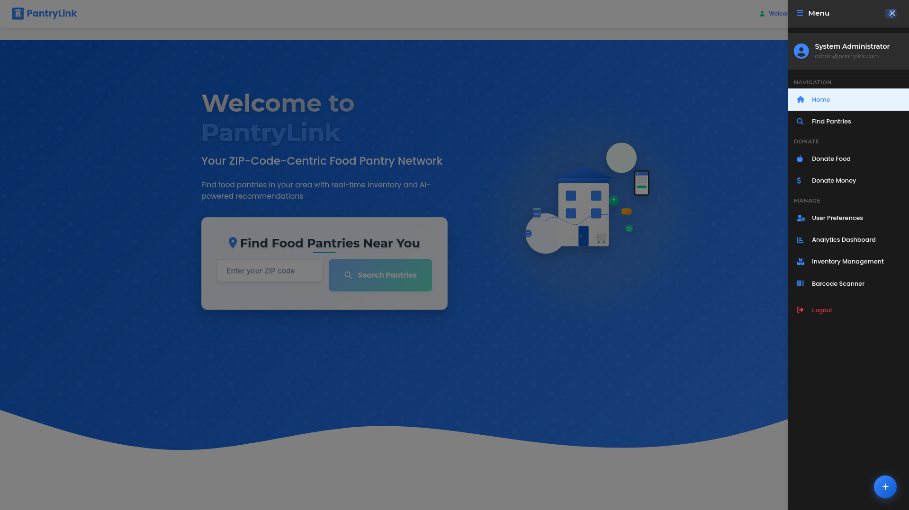
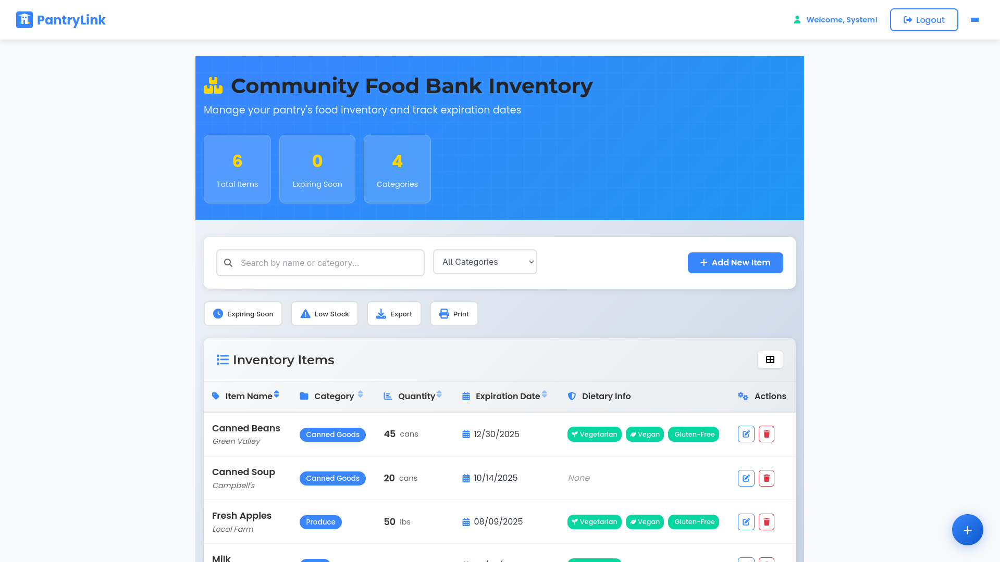
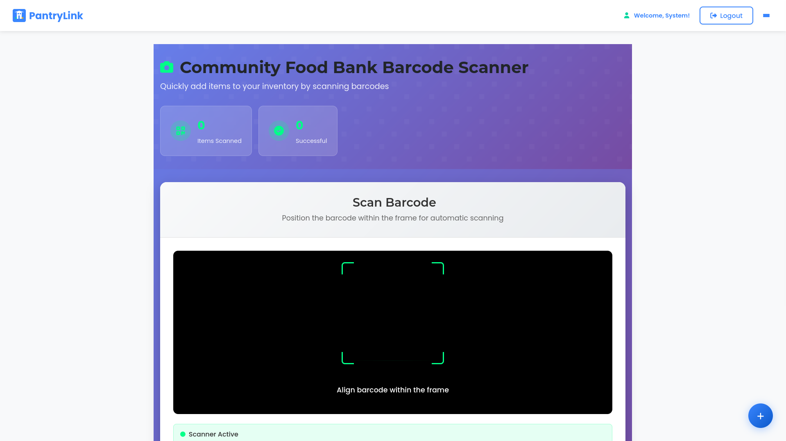
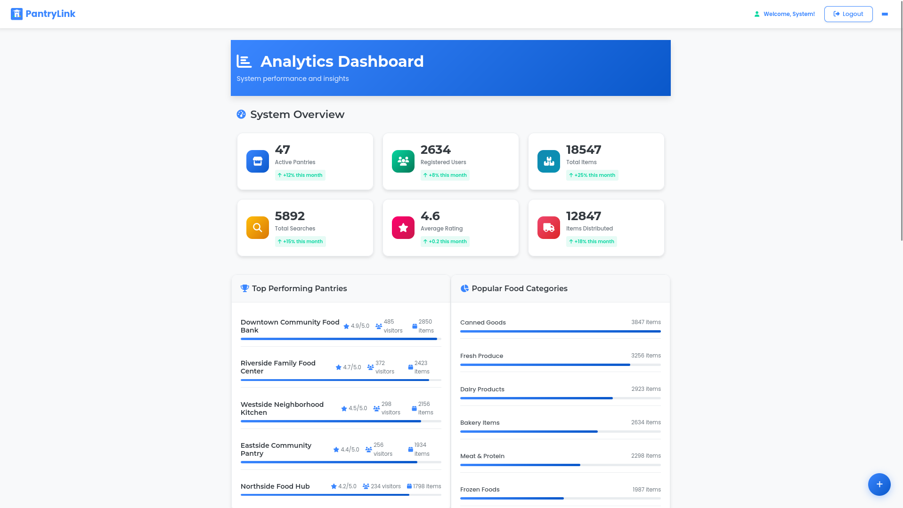
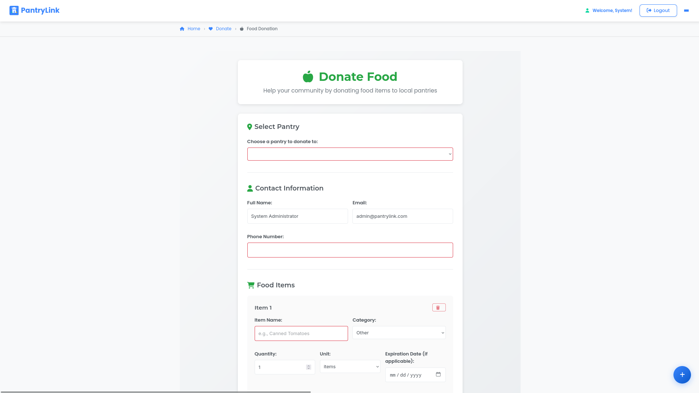

# PantryLink
A comprehensive food pantry management system designed to streamline operations, connect communities, and reduce food waste through efficient inventory management and donation system.

**Tech Stack:**
- **Frontend**: Angular 20 / TypeScript
- **Backend**: ASP.NET Core 8, MySQL

## Screenshots

